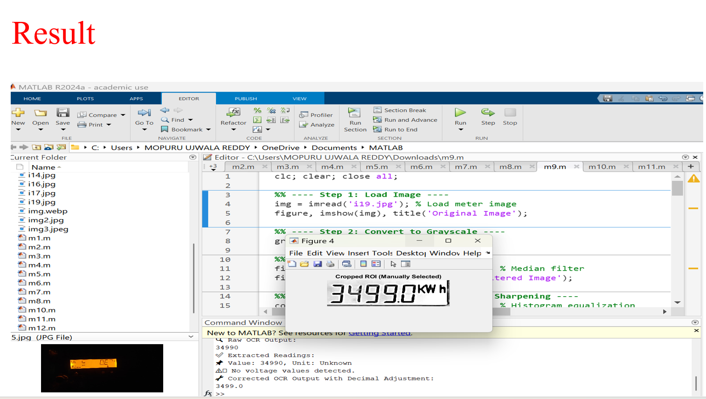
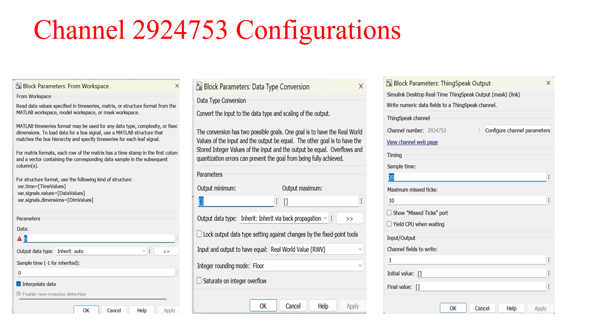
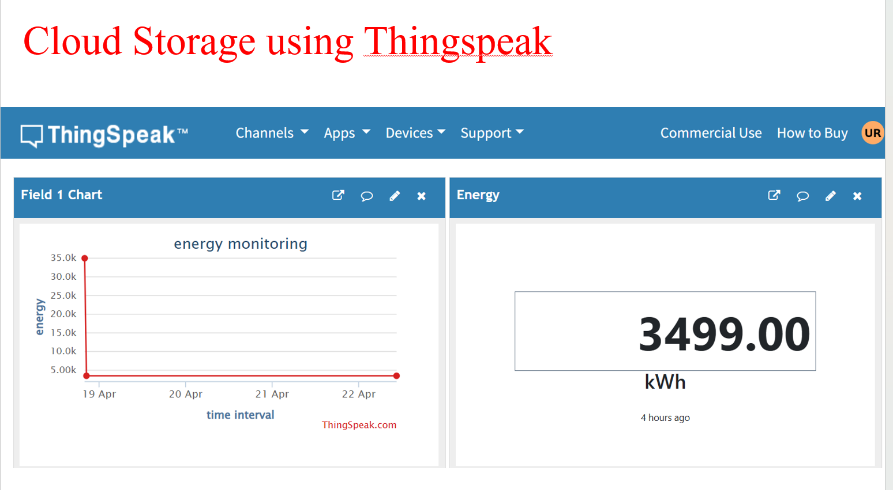

# Automated Energy Meter Reading using Image Processing and IoT

This project automates the process of reading energy meter values using image processing and Optical Character Recognition (OCR) in MATLAB. The extracted data is transmitted to the cloud via ThingSpeak for real-time monitoring, without the use of physical microcontrollers.

##  Overview

This system captures energy meter images, processes them to extract digits, and uploads the readings to a cloud platform using MATLAB and Simulink. It's designed as a low-cost and efficient alternative to manual or hardware-based meter reading.

##  Key Features

- OCR pipeline using MATLAB image processing
- Real-time data transmission using ThingSpeak cloud
- No physical microcontroller needed (simulated via Simulink)
- Remote monitoring dashboard with real-time plots

##  Project Structure

- `Final_Report.pdf`: Full project documentation  
- `Workflow Automated Energy Meter Reading.txt`: Step-by-step process description  
- `Simulink_Block_Diagram.png`: System diagram  
- `Sample_Images/`: Input images used for OCR testing  
- `Result*.png`: Output results of processed images  

##  Technologies Used

- MATLAB Image Processing Toolbox  
- Simulink  
- ThingSpeak IoT Cloud Platform  
- OCR Techniques  
- Computer Vision  

##  How It Works

1. Capture or upload an energy meter image to MATLAB.
2. Apply preprocessing and OCR to extract numerical values.
3. Store extracted data in MATLAB workspace.
4. Use Simulink to send the data to ThingSpeak.
5. Monitor live readings on the ThingSpeak dashboard.

##  Sample Output

##  Cloud Visualization

Below are sample visualizations generated on ThingSpeak, showcasing how the extracted energy readings are plotted over time for cloud-based monitoring.

| Visualization Sample 1 | Visualization Sample 2 |
|------------------------|------------------------|
|  |  |

##  Resources

- [ThingSpeak Documentation](https://thingspeak.com/docs)
- [MATLAB OCR Function](https://www.mathworks.com/help/vision/ref/ocr.html)
